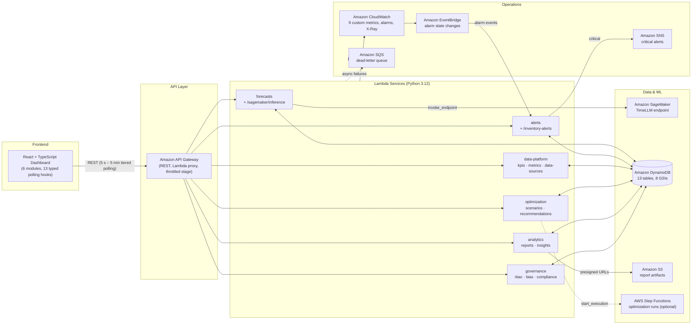

# TimeWise Supply Chain — AWS TimeLLM Platform

An AI-powered supply chain optimization platform: a React + TypeScript dashboard backed by six serverless domain services on AWS. Demand forecasts are generated by a TimeLLM time-series model hosted on Amazon SageMaker, persisted in DynamoDB, and served through API Gateway and Lambda, with CloudWatch-driven alerting escalated to SNS.

## Architecture



### Component Status

| Component | AWS Services | Status |
|---|---|---|
| Forecast API (CRUD + ML inference) | Lambda + API Gateway + SageMaker | Implemented |
| Alerting API (alerts + inventory alerts) | Lambda + API Gateway | Implemented |
| Alarm-driven alert intake | CloudWatch → EventBridge → Lambda → SNS | Implemented |
| Data-platform API (KPIs, metrics, data sources) | Lambda + DynamoDB | Implemented |
| Optimization API (scenarios, recommendations) | Lambda + DynamoDB (+ Step Functions) | Implemented |
| Analytics API (reports to S3, insights) | Lambda + DynamoDB + S3 | Implemented |
| Governance API (RBAC, governance, bias) | Lambda + DynamoDB | Implemented |
| Persistence layer (13 tables, 8 GSIs) | DynamoDB via CloudFormation | Implemented |
| Observability (metrics, X-Ray, DLQ, log retention) | CloudWatch, SQS | Implemented |
| TimeLLM model hosting | SageMaker endpoint | Integration implemented; model deployed separately |
| Data-lake ingestion & ETL | S3 + Glue | Designed (not yet provisioned) |
| Authentication | Cognito | Planned (bearer-token plumbing in client; API is currently unauthenticated) |

## Data Flow

1. **Ingestion (designed)** — Historical sales, market trends, and inventory data land in an S3 data lake and are cleaned by AWS Glue ETL jobs.
2. **Inference** — `POST /forecasts` invokes the SageMaker TimeLLM endpoint with historical data, forecast horizon, and external factors; `POST /sagemaker/inference` runs the same model without persistence for what-if exploration.
3. **Persistence** — Predictions, confidence, and model version are written to DynamoDB with UUID keys and ISO-8601 timestamps.
4. **Serving** — Six Lambda services route requests internally (method + path template router) behind API Gateway Lambda-proxy integration; list endpoints paginate via opaque `nextToken` cursors backed by DynamoDB `LastEvaluatedKey`.
5. **Presentation** — The dashboard polls typed endpoints on tiered intervals (5 s alerts → 5 min reports), pauses when the tab is hidden, backs off exponentially on failures, and falls back to static demo data when the API is unreachable.
6. **Monitoring** — Services emit 9 custom CloudWatch metrics across 5 namespaces; alarm state changes flow through EventBridge back into the alerts service, which classifies them into 5 supply-chain categories and publishes critical alerts to SNS. Failed async invocations land in an SQS dead-letter queue.

## Tech Stack

| Layer | Technologies |
|---|---|
| Frontend | React 18, TypeScript, Vite, Tailwind CSS, Lucide React |
| Backend | Python 3.12 Lambda services (boto3), shared routing/response library |
| Data & ML | DynamoDB (on-demand), SageMaker (TimeLLM), S3 (report artifacts), Step Functions (optional executor) |
| Operations | CloudWatch custom metrics + alarms, X-Ray tracing, EventBridge, SNS, SQS DLQ |
| Infrastructure | CloudFormation — 3 parameterized stacks (dev / staging / prod), 90 resources |

## Repository Structure

```
├── aws/
│   ├── cloudformation/
│   │   ├── dynamodb-tables.yaml     # 13 tables, 8 GSIs, PITR, TTL
│   │   ├── lambda-functions.yaml    # 6 functions, least-privilege IAM, DLQ,
│   │   │                            #   X-Ray, log retention, EventBridge, SNS
│   │   └── api-gateway.yaml         # REST API: 14 resources -> 6 services
│   └── lambda/
│       ├── common.py                # router, responses, pagination, validation, metrics
│       ├── forecasts-handler.py     # /forecasts, /sagemaker/inference
│       ├── alerts-handler.py        # /alerts, /inventory-alerts, alarm intake
│       ├── data-platform-handler.py # /kpis, /metrics, /data-sources
│       ├── optimization-handler.py  # /optimization-scenarios, /inventory-optimizations
│       ├── analytics-handler.py     # /reports, /analytics-insights
│       └── governance-handler.py    # /access-controls, /governance-metrics, /bias-detections
└── src/
    ├── components/                  # 6 dashboard modules + shared UI
    ├── config/aws.ts                # runtime config (import.meta.env) + endpoint map
    ├── hooks/useApiData.ts          # visibility-aware polling hook + 13 domain hooks
    ├── services/apiService.ts       # typed client: timeouts, ApiError, 24 methods
    └── types/index.ts               # shared domain models & response envelopes
```

## API Reference — 14 resources, 24 routes, 6 services

| Service | Method & Path | Description |
|---|---|---|
| forecasts | `GET /forecasts` | List forecasts; `?productId=` queries `ProductIndex`, paginated |
| forecasts | `POST /forecasts` | Validate input, invoke TimeLLM, persist prediction |
| forecasts | `PUT /forecasts/{id}` | Update status (conditional write, 404 on missing) |
| forecasts | `POST /sagemaker/inference` | Direct model inference without persistence |
| alerts | `GET /alerts` | List alerts; `?category=` queries `CategoryTimeIndex` |
| alerts | `POST /alerts` | Create alert, emit dimensioned metric |
| alerts | `POST /alerts/{id}/acknowledge` | Acknowledge (conditional write) |
| alerts | `GET /inventory-alerts` | List; `?productId=` queries `ProductSeverityIndex` |
| alerts | `POST /inventory-alerts/{id}/acknowledge` | Acknowledge inventory alert |
| data-platform | `GET /kpis` | Latest datapoint per KPI; `?kpiId=` returns history |
| data-platform | `GET /metrics` | Metric points; `?metricId=` queries time series |
| data-platform | `GET /data-sources` | List sources; `?type=` queries `TypeIndex` |
| data-platform | `PUT /data-sources/{id}` | Field-whitelisted update |
| optimization | `GET /optimization-scenarios` | List scenarios |
| optimization | `POST /optimization-scenarios/{id}/run` | Start run (Step Functions when configured), returns 202 |
| optimization | `GET /inventory-optimizations` | List recommendations |
| optimization | `POST /inventory-optimizations/{id}/apply` | Apply once (idempotency-guarded conditional write) |
| analytics | `GET /reports` | List reports, newest first |
| analytics | `POST /reports/{id}/generate` | Render artifact to S3, return presigned URL |
| analytics | `GET /analytics-insights` | List insights; `?category=` queries `CategoryTimeIndex` |
| governance | `GET /access-controls` | List users; `?role=` queries `RoleIndex` |
| governance | `PUT /access-controls/{userId}` | Replace permission set (closed vocabulary, audited) |
| governance | `GET /governance-metrics` | Governance checks, newest first |
| governance | `GET /bias-detections` | Detections; `?modelComponent=` queries `ModelIndex` |

Conventions shared by every service (implemented in [aws/lambda/common.py](aws/lambda/common.py)): CORS preflight answered by the router, list responses as `{items, count, nextToken?}`, validation errors as 400, missing resources as 404, unexpected failures logged and returned as sanitized 500s.

## DynamoDB Schema — 13 tables

All tables use on-demand billing and point-in-time recovery; names are suffixed with the environment (e.g. `timewise-forecasts-prod`).

| Table | Key Schema | Indexes / Features |
|---|---|---|
| `timewise-forecasts` | `forecastId` | GSI `ProductIndex` (productId, createdAt) |
| `timewise-alerts` | `alertId` | GSI `CategoryTimeIndex` (category, timestamp) |
| `timewise-inventory-alerts` | `alertId` | GSI `ProductSeverityIndex` (productId, severity) |
| `timewise-kpis` | `kpiId` + `timestamp` | TTL expiry |
| `timewise-metrics` | `metricId` + `timestamp` | TTL expiry |
| `timewise-data-sources` | `sourceId` | GSI `TypeIndex` (sourceType) |
| `timewise-optimization-scenarios` | `scenarioId` | — |
| `timewise-inventory-optimizations` | `optimizationId` | GSI `ProductIndex` (productId, createdAt) |
| `timewise-reports` | `reportId` | — |
| `timewise-analytics-insights` | `insightId` | GSI `CategoryTimeIndex` (category, createdAt) |
| `timewise-access-controls` | `userId` | GSI `RoleIndex` (role) |
| `timewise-governance-metrics` | `metricId` + `timestamp` | — (retained for audit) |
| `timewise-bias-detections` | `detectionId` | GSI `ModelIndex` (modelComponent, detectedAt) |

## Getting Started

### Prerequisites

- Node.js 18+ and npm
- An AWS account with permissions for CloudFormation, DynamoDB, Lambda, API Gateway, IAM, CloudWatch, EventBridge, SNS, SQS, and S3
- AWS CLI configured (`aws configure`)
- An S3 bucket for Lambda deployment packages

### 1. Install and Configure

```bash
npm install
cp .env.example .env   # then set your values
```

| Variable | Purpose |
|---|---|
| `VITE_AWS_REGION` | Deployment region (default `us-east-1`) |
| `VITE_API_GATEWAY_URL` | `APIGatewayURL` output of the API stack |
| `VITE_COGNITO_USER_POOL_ID` / `VITE_COGNITO_CLIENT_ID` | Reserved for planned Cognito authentication |
| `VITE_ENABLE_*` | Feature flags (default enabled) |

### 2. Deploy DynamoDB Tables

```bash
aws cloudformation deploy \
  --template-file aws/cloudformation/dynamodb-tables.yaml \
  --stack-name timewise-dynamodb \
  --parameter-overrides Environment=prod
```

### 3. Package and Upload Lambda Code

Each zip contains the service handler plus the shared `common.py`:

```bash
cd aws/lambda
for svc in forecasts alerts data-platform optimization analytics governance; do
  zip "${svc}-handler.zip" "${svc}-handler.py" common.py
  aws s3 cp "${svc}-handler.zip" "s3://YOUR-CODE-BUCKET/lambda/"
done
cd ../..
```

### 4. Deploy Lambda Services

```bash
aws cloudformation deploy \
  --template-file aws/cloudformation/lambda-functions.yaml \
  --stack-name timewise-lambda \
  --capabilities CAPABILITY_NAMED_IAM \
  --parameter-overrides \
    Environment=prod \
    CodeBucket=YOUR-CODE-BUCKET
```

Optional parameters: `SageMakerEndpointName` (TimeLLM endpoint; POST forecast routes return 503 until set), `ReportsBucket` (report artifacts), `StateMachineArn` (optimization executor), `AlertEmail` (SNS subscription).

### 5. Deploy API Gateway

```bash
ARNS=$(aws cloudformation describe-stacks --stack-name timewise-lambda \
  --query "Stacks[0].Outputs" --output json)
get() { echo "$ARNS" | python -c "import sys,json;print(next(o['OutputValue'] for o in json.load(sys.stdin) if o['OutputKey']=='$1'))"; }

aws cloudformation deploy \
  --template-file aws/cloudformation/api-gateway.yaml \
  --stack-name timewise-api \
  --parameter-overrides \
    Environment=prod \
    ForecastsLambdaArn=$(get ForecastsFunctionArn) \
    AlertsLambdaArn=$(get AlertsFunctionArn) \
    DataPlatformLambdaArn=$(get DataPlatformFunctionArn) \
    OptimizationLambdaArn=$(get OptimizationFunctionArn) \
    AnalyticsLambdaArn=$(get AnalyticsFunctionArn) \
    GovernanceLambdaArn=$(get GovernanceFunctionArn)
```

Copy the `APIGatewayURL` stack output into `VITE_API_GATEWAY_URL` in `.env`.

> **Cost note:** the serverless tier (Lambda, API Gateway, on-demand DynamoDB, SNS, SQS, EventBridge) costs effectively nothing at development scale. A SageMaker real-time endpoint bills per instance-hour while it exists — delete it when idle.

### 6. Run the Dashboard

```bash
npm run dev       # local development
npm run build     # production build
npm run lint      # eslint (CI gate)
npx tsc --noEmit -p tsconfig.app.json   # type-check (CI gate)
```

### Teardown

```bash
aws cloudformation delete-stack --stack-name timewise-api
aws cloudformation delete-stack --stack-name timewise-lambda
aws cloudformation delete-stack --stack-name timewise-dynamodb
```

## Monitoring & Observability

Nine custom CloudWatch metrics across five namespaces, emitted through a fail-safe helper (metric failures never fail a request). IAM restricts `PutMetricData` to `TimeWise/*` namespaces.

| Namespace | Metric | Dimensions | Emitted By |
|---|---|---|---|
| `TimeWise/API` | `ForecastsRetrieved` | — | forecasts |
| `TimeWise/ML` | `ForecastGenerated` | — | forecasts |
| `TimeWise/ML` | `ForecastAccuracy` | — | forecasts |
| `TimeWise/ML` | `DirectInference` | — | forecasts |
| `TimeWise/Alerts` | `AlertsCreated` | AlertType, Category | alerts |
| `TimeWise/Operations` | `OptimizationRunStarted` | Status | optimization |
| `TimeWise/Operations` | `OptimizationApplied` | — | optimization |
| `TimeWise/Operations` | `ReportGenerated` | ReportType | analytics |
| `TimeWise/Governance` | `AccessControlChanged` | — | governance |

Additional operational surface: X-Ray active tracing on every function and the API stage, 30-day log retention, a shared SQS dead-letter queue (14-day retention) for failed async invocations, API Gateway stage throttling (50 rps, burst 100), and EventBridge routing of every CloudWatch alarm state change into the alerts service.

## Security

- **Least-privilege IAM per function** — each of the six roles can touch only its own tables (and indexes); SageMaker/S3/Step Functions grants exist only when the corresponding feature is configured
- **Namespace-scoped metrics** — `cloudwatch:PutMetricData` conditioned to `TimeWise/*`
- **Input validation everywhere** — closed status/permission vocabularies, field whitelists on updates, JSON schema checks, bounded page sizes and forecast horizons
- **Auditable RBAC changes** — permission updates log structured before/after audit records with the acting principal
- **Encryption** — DynamoDB at rest (default), S3 report artifacts with SSE, HTTPS in transit; report downloads via expiring presigned URLs
- **Known gap:** API methods are `AuthorizationType: NONE` — the client sends a bearer token but nothing verifies it yet. Cognito user pools + an API Gateway authorizer are the planned fix and the top roadmap item.

## Roadmap

- [ ] Cognito authentication + API Gateway authorizer (close the auth gap)
- [ ] Provision the S3 + Glue data-lake ingestion pipeline
- [ ] Step Functions optimization executor (the API already dispatches to it when configured)
- [ ] Automated test suite (pytest for services, vitest for hooks) and CI pipeline
- [ ] CloudWatch alarm definitions + dashboard as code
- [ ] Multi-region deployment

---

## Appendix: Verified Implementation Inventory

Every quantified claim above is reproducible from the repository — see [Reproducing These Counts](#reproducing-these-counts).

### A. Infrastructure — 3 stacks, 90 resources

| Stack | Resources | Contents |
|---|---|---|
| [dynamodb-tables.yaml](aws/cloudformation/dynamodb-tables.yaml) | 13 | 13 tables (8 GSIs, PITR on all, TTL on `kpis` + `metrics`), name exports |
| [lambda-functions.yaml](aws/cloudformation/lambda-functions.yaml) | 23 | 6 functions + 6 roles + 6 log groups, SNS topic (+ conditional email), SQS DLQ, EventBridge rule + permission |
| [api-gateway.yaml](aws/cloudformation/api-gateway.yaml) | 54 | REST API, 14 top-level resources with `{proxy+}` children, 22 ANY methods, 6 invoke permissions, deployment + throttled stage |

Conditional wiring in the Lambda stack (`Fn::If` on empty parameters): SageMaker invoke rights and env var, Step Functions dispatch, S3 report access, SNS email subscription — features degrade gracefully rather than failing when unconfigured.

### B. Lambda Services — 6 services, 24 routes, shared library

All services are Python 3.12, X-Ray traced, DLQ-attached, with table names injected via environment variables (no hardcoded names — the environment suffix bug this replaced is documented in git history).

| Service | Routes | Notable Implementation Details |
|---|---|---|
| [forecasts-handler.py](aws/lambda/forecasts-handler.py) | 4 | Validates horizon (1–24) and history; distinguishes model-unavailable (503) from malformed model output (502); conditional status updates |
| [alerts-handler.py](aws/lambda/alerts-handler.py) | 5 | Dual-trigger (API + EventBridge alarm events); 5-category keyword classification; SNS escalation for critical alerts |
| [data-platform-handler.py](aws/lambda/data-platform-handler.py) | 4 | Latest-per-series KPI reduction; field-whitelisted data-source updates |
| [optimization-handler.py](aws/lambda/optimization-handler.py) | 4 | 202 + run record on dispatch; idempotency guard (`status = proposed`) on apply |
| [analytics-handler.py](aws/lambda/analytics-handler.py) | 3 | Renders report artifacts to S3 (SSE) and returns expiring presigned URLs |
| [governance-handler.py](aws/lambda/governance-handler.py) | 4 | Closed permission vocabulary; structured before/after audit logging |

[common.py](aws/lambda/common.py) provides the method+path-template router (which also answers CORS preflight), typed error hierarchy (`ApiError` → `ValidationError`/`NotFoundError`), Decimal-safe JSON serialization, base64 pagination cursors, required-field validation, and the fail-safe metric emitter.

### C. Frontend — typed client, resilient polling

- [src/types/index.ts](src/types/index.ts) — 14 domain models + response envelopes shared by client and hooks.
- [src/services/apiService.ts](src/services/apiService.ts) — 24 typed public methods over one `request` core: 15 s `AbortController` timeout, `ApiError` with status + body, bearer-token injection, guard when the API URL is unconfigured.
- [src/hooks/useApiData.ts](src/hooks/useApiData.ts) — generic hook + 13 domain hooks; pauses polling on hidden tabs (with immediate refresh on return), exponential backoff on consecutive failures (capped at 5 min), stale-response suppression after unmount.
- [src/config/aws.ts](src/config/aws.ts) — reads `import.meta.env` (the Vite-correct API; the `process.env` bug this replaced meant env vars were silently ignored).
- Polling tiers (ms values in code): alerts 5 s; inventory-alerts, metrics 10 s; data-sources 15 s; KPIs, governance 30 s; forecasts, inventory-optimizations, access-controls, bias-detections 60 s; scenarios 120 s; insights 180 s; reports 300 s.
- Static fallback data in components (e.g. [src/App.tsx](src/App.tsx)) renders when the API is unreachable — those placeholder figures are demo values, not measurements.

### D. Codebase Statistics

5,985 lines across TypeScript/TSX, Python, and CloudFormation YAML: ~2,400 frontend components, ~800 frontend client/hooks/config/types, ~1,300 Lambda services, ~1,500 CloudFormation.

### Reproducing These Counts

```bash
# 13 tables, 8 GSIs, 13 PITR blocks, 2 TTL blocks
grep -c "AWS::DynamoDB::Table"             aws/cloudformation/dynamodb-tables.yaml
grep -c "IndexName:"                       aws/cloudformation/dynamodb-tables.yaml
grep -c "PointInTimeRecoverySpecification" aws/cloudformation/dynamodb-tables.yaml
grep -c "TimeToLiveSpecification"          aws/cloudformation/dynamodb-tables.yaml

# 6 Lambda functions, 24 routes, 14 API endpoints, 13 domain hooks
grep -c "AWS::Lambda::Function" aws/cloudformation/lambda-functions.yaml
grep -ch "@router.route" aws/lambda/*-handler.py | paste -sd+ | bc
grep -c "base}/"                src/config/aws.ts
grep -c "^export function use"  src/hooks/useApiData.ts   # 14 = 1 generic + 13 domain

# 9 custom metrics across 5 namespaces
grep -rhoE '"[A-Za-z]+(Retrieved|Generated|Accuracy|Inference|Created|Started|Applied|Changed)"' aws/lambda/*-handler.py | sort -u
grep -rhoE 'NAMESPACE\}/[A-Za-z]+' aws/lambda/*-handler.py | sort -u

# Build gates
npm run lint && npx tsc --noEmit -p tsconfig.app.json && npm run build
python -m py_compile aws/lambda/*.py

# Total lines of code
find src aws -name "*.ts" -o -name "*.tsx" -o -name "*.py" -o -name "*.yaml" | xargs wc -l
```

## License

MIT
