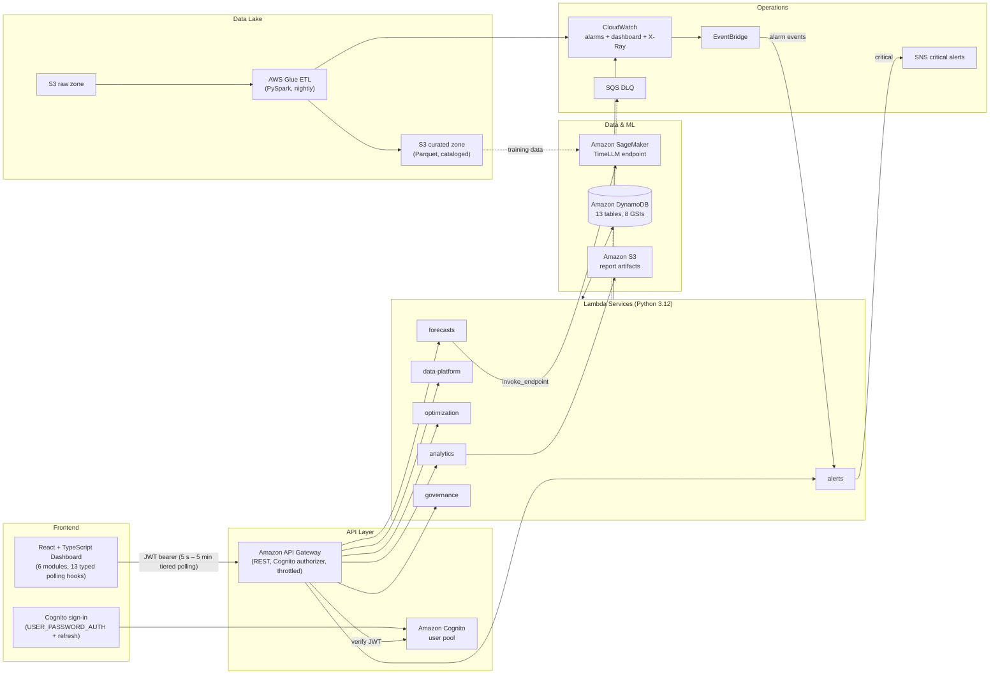

# TimeWise Supply Chain — AWS TimeLLM Platform

An AI-powered supply chain optimization platform: a React + TypeScript dashboard behind Cognito authentication, six serverless domain services on AWS, an S3 + Glue data lake, and a SageMaker-hosted TimeLLM model for demand forecasting — all provisioned by six CloudFormation stacks and gated by CI.

## Architecture



### Component Status

| Component | AWS Services | Status |
|---|---|---|
| Authentication (login, refresh, sign-out, API authorizer) | Cognito + API Gateway | Implemented |
| Six domain APIs (24 routes across 14 resources) | Lambda + API Gateway | Implemented |
| Alarm-driven alert intake + escalation | CloudWatch → EventBridge → Lambda → SNS | Implemented |
| Persistence (13 tables, 8 GSIs) | DynamoDB via CloudFormation | Implemented |
| Data lake (raw/curated zones, nightly PySpark ETL, catalog crawler) | S3 + Glue | Implemented |
| Observability (9 alarms, ops dashboard, X-Ray, DLQ, log retention) | CloudWatch, SQS | Implemented |
| Automated tests + CI (47 tests: 34 backend, 13 frontend) | GitHub Actions | Implemented |
| TimeLLM serving (inference handler + deploy tooling) | SageMaker | Implemented; model weights come from the training pipeline |
| TimeLLM training pipeline | SageMaker Training | Not in this repo |

## Data Flow

1. **Ingestion** — Raw sales drops land in the encrypted S3 raw zone; the nightly Glue PySpark job validates, deduplicates, and quarantines bad rows, writing partitioned Parquet to the curated zone that a scheduled crawler catalogs.
2. **Inference** — `POST /forecasts` invokes the SageMaker TimeLLM endpoint (quantile forecasts with prediction intervals); `POST /sagemaker/inference` runs the model without persistence for what-if exploration.
3. **Persistence** — Predictions, confidence, and model version are written to DynamoDB with UUID keys and ISO-8601 timestamps.
4. **Serving** — Six Lambda services route requests internally behind API Gateway with a Cognito JWT authorizer; list endpoints paginate via opaque `nextToken` cursors.
5. **Presentation** — The dashboard signs in against Cognito, silently refreshes tokens, polls typed endpoints on tiered intervals (5 s alerts → 5 min reports), pauses on hidden tabs, backs off on failures, and falls back to demo data when the API is unreachable.
6. **Monitoring** — Services emit custom metrics; 9 CloudWatch alarms page the SNS topic and simultaneously feed the alerts service through EventBridge, which classifies them into 5 supply-chain categories. Failed async invocations land in an SQS dead-letter queue.

## Tech Stack

| Layer | Technologies |
|---|---|
| Frontend | React 18, TypeScript, Vite, Tailwind CSS, Vitest |
| Auth | Cognito user pool (USER_PASSWORD_AUTH + refresh-token flows, dependency-free client) |
| Backend | Python 3.12 Lambda services (boto3), shared routing/response library, unittest suite |
| Data & ML | DynamoDB (on-demand), SageMaker (PyTorch serving), S3 + Glue 4.0 (PySpark) |
| Operations | CloudWatch alarms/dashboard/X-Ray, EventBridge, SNS, SQS DLQ |
| Infrastructure & CI | CloudFormation — 6 stacks, 133 resources; GitHub Actions (lint, types, tests, build, cfn-lint) |

## Repository Structure

```
├── .github/workflows/ci.yml         # frontend, backend, and CFN validation jobs
├── aws/
│   ├── cloudformation/
│   │   ├── cognito.yaml             # user pool + SPA client
│   │   ├── dynamodb-tables.yaml     # 13 tables, 8 GSIs, PITR, TTL
│   │   ├── lambda-functions.yaml    # 6 functions, least-privilege IAM, DLQ, X-Ray, SNS, EventBridge
│   │   ├── api-gateway.yaml         # 14 resources -> 6 services, Cognito authorizer, CORS preflight
│   │   ├── monitoring.yaml          # 9 alarms + operations dashboard
│   │   └── data-lake.yaml           # raw/curated buckets, Glue database/job/crawler
│   ├── lambda/
│   │   ├── common.py                # router, responses, pagination, validation, metrics
│   │   ├── *-handler.py             # forecasts, alerts, data-platform, optimization, analytics, governance
│   │   └── tests/                   # 34 unittest cases against in-memory AWS fakes
│   ├── glue/etl_sales_data.py       # PySpark: validate, dedupe, quarantine, partitioned Parquet
│   └── sagemaker/
│       ├── inference.py             # model_fn/input_fn/predict_fn/output_fn for TimeLLM serving
│       └── deploy.py                # endpoint deploy/teardown tooling
└── src/
    ├── components/                  # 6 dashboard modules, login page, shared UI
    ├── config/aws.ts                # runtime config (import.meta.env) + endpoint map
    ├── hooks/useApiData.ts          # visibility-aware polling hook + 13 domain hooks
    ├── services/                    # apiService (24 typed methods) + authService (Cognito flows) + tests
    └── types/index.ts               # shared domain models & response envelopes
```

## API Reference — 14 resources, 24 routes, 6 services

All routes require a Cognito JWT when the API stack is deployed with `UserPoolArn`; CORS preflights are answered by unauthenticated MOCK OPTIONS methods.

| Service | Method & Path | Description |
|---|---|---|
| forecasts | `GET /forecasts` | List; `?productId=` queries `ProductIndex`, paginated |
| forecasts | `POST /forecasts` | Validate, invoke TimeLLM, persist prediction |
| forecasts | `PUT /forecasts/{id}` | Update status (conditional write, 404 on missing) |
| forecasts | `POST /sagemaker/inference` | Direct inference without persistence |
| alerts | `GET /alerts` · `POST /alerts` · `POST /alerts/{id}/acknowledge` | Alert CRUD; `?category=` queries `CategoryTimeIndex` |
| alerts | `GET /inventory-alerts` · `POST /inventory-alerts/{id}/acknowledge` | Inventory alerts; `?productId=` queries `ProductSeverityIndex` |
| data-platform | `GET /kpis` · `GET /metrics` · `GET /data-sources` · `PUT /data-sources/{id}` | Latest-per-series KPI reduction; time-series queries; whitelisted updates |
| optimization | `GET /optimization-scenarios` · `POST .../{id}/run` | 202-dispatch to Step Functions when configured |
| optimization | `GET /inventory-optimizations` · `POST .../{id}/apply` | Idempotency-guarded apply |
| analytics | `GET /reports` · `POST /reports/{id}/generate` · `GET /analytics-insights` | Artifacts rendered to S3 with expiring presigned URLs |
| governance | `GET /access-controls` · `PUT /access-controls/{userId}` · `GET /governance-metrics` · `GET /bias-detections` | Closed permission vocabulary; audited changes with Cognito identity |

Shared conventions ([aws/lambda/common.py](aws/lambda/common.py)): `{items, count, nextToken?}` list envelopes, 400 validation / 404 not-found / sanitized 500 errors, CORS handled centrally.

## DynamoDB Schema — 13 tables

All tables: on-demand billing, point-in-time recovery, environment-suffixed names.

| Table | Key Schema | Indexes / Features |
|---|---|---|
| `timewise-forecasts` | `forecastId` | GSI `ProductIndex` (productId, createdAt) |
| `timewise-alerts` | `alertId` | GSI `CategoryTimeIndex` (category, timestamp) |
| `timewise-inventory-alerts` | `alertId` | GSI `ProductSeverityIndex` (productId, severity) |
| `timewise-kpis` | `kpiId` + `timestamp` | TTL expiry |
| `timewise-metrics` | `metricId` + `timestamp` | TTL expiry |
| `timewise-data-sources` | `sourceId` | GSI `TypeIndex` (sourceType) |
| `timewise-optimization-scenarios` | `scenarioId` | — |
| `timewise-inventory-optimizations` | `optimizationId` | GSI `ProductIndex` (productId, createdAt) |
| `timewise-reports` | `reportId` | — |
| `timewise-analytics-insights` | `insightId` | GSI `CategoryTimeIndex` (category, createdAt) |
| `timewise-access-controls` | `userId` | GSI `RoleIndex` (role) |
| `timewise-governance-metrics` | `metricId` + `timestamp` | retained for audit |
| `timewise-bias-detections` | `detectionId` | GSI `ModelIndex` (modelComponent, detectedAt) |

## Getting Started

### Prerequisites

- Node.js 18+ and npm; Python 3.12 for backend tests
- AWS CLI configured with permissions for the services above
- An S3 bucket for deployment artifacts (Lambda zips, Glue script)

### 1. Install, Test, Configure

```bash
npm install
npm run lint && npx tsc --noEmit -p tsconfig.app.json   # static gates
npm test                                                # 13 frontend tests
npm run test:py                                         # 34 backend tests
cp .env.example .env
```

| Variable | Purpose |
|---|---|
| `VITE_AWS_REGION` | Deployment region (default `us-east-1`) |
| `VITE_API_GATEWAY_URL` | `APIGatewayURL` output of the API stack |
| `VITE_COGNITO_USER_POOL_ID` / `VITE_COGNITO_CLIENT_ID` | Cognito stack outputs; when unset the dashboard runs in demo mode without a login gate |
| `VITE_ENABLE_*` | Feature flags (default enabled) |

### 2. Deploy Cognito and DynamoDB

```bash
aws cloudformation deploy --template-file aws/cloudformation/cognito.yaml \
  --stack-name timewise-cognito --parameter-overrides Environment=prod

aws cloudformation deploy --template-file aws/cloudformation/dynamodb-tables.yaml \
  --stack-name timewise-dynamodb --parameter-overrides Environment=prod
```

Create users with `aws cognito-idp admin-create-user --user-pool-id <UserPoolId> --username <email>`.

### 3. Package and Deploy Lambda Services

```bash
cd aws/lambda
for svc in forecasts alerts data-platform optimization analytics governance; do
  zip "${svc}-handler.zip" "${svc}-handler.py" common.py
  aws s3 cp "${svc}-handler.zip" "s3://YOUR-CODE-BUCKET/lambda/"
done
cd ../..

aws cloudformation deploy --template-file aws/cloudformation/lambda-functions.yaml \
  --stack-name timewise-lambda --capabilities CAPABILITY_NAMED_IAM \
  --parameter-overrides Environment=prod CodeBucket=YOUR-CODE-BUCKET
```

Optional parameters: `SageMakerEndpointName`, `ReportsBucket`, `StateMachineArn`, `AlertEmail`.

### 4. Deploy API Gateway (with the Cognito authorizer)

```bash
ARNS=$(aws cloudformation describe-stacks --stack-name timewise-lambda \
  --query "Stacks[0].Outputs" --output json)
get() { echo "$ARNS" | python -c "import sys,json;print(next(o['OutputValue'] for o in json.load(sys.stdin) if o['OutputKey']=='$1'))"; }
POOL_ARN=$(aws cloudformation describe-stacks --stack-name timewise-cognito \
  --query "Stacks[0].Outputs[?OutputKey=='UserPoolArn'].OutputValue" --output text)

aws cloudformation deploy --template-file aws/cloudformation/api-gateway.yaml \
  --stack-name timewise-api \
  --parameter-overrides Environment=prod UserPoolArn=$POOL_ARN \
    ForecastsLambdaArn=$(get ForecastsFunctionArn) \
    AlertsLambdaArn=$(get AlertsFunctionArn) \
    DataPlatformLambdaArn=$(get DataPlatformFunctionArn) \
    OptimizationLambdaArn=$(get OptimizationFunctionArn) \
    AnalyticsLambdaArn=$(get AnalyticsFunctionArn) \
    GovernanceLambdaArn=$(get GovernanceFunctionArn)
```

Omit `UserPoolArn` to deploy an unauthenticated dev API.

### 5. Deploy Monitoring and the Data Lake

```bash
TOPIC=$(aws cloudformation describe-stacks --stack-name timewise-lambda \
  --query "Stacks[0].Outputs[?OutputKey=='CriticalAlertsTopicArn'].OutputValue" --output text)

aws cloudformation deploy --template-file aws/cloudformation/monitoring.yaml \
  --stack-name timewise-monitoring \
  --parameter-overrides Environment=prod CriticalAlertsTopicArn=$TOPIC

aws s3 cp aws/glue/etl_sales_data.py s3://YOUR-CODE-BUCKET/glue/
aws cloudformation deploy --template-file aws/cloudformation/data-lake.yaml \
  --stack-name timewise-data-lake --capabilities CAPABILITY_NAMED_IAM \
  --parameter-overrides Environment=prod GlueScriptsBucket=YOUR-CODE-BUCKET
```

### 6. (Optional) Deploy the TimeLLM Endpoint

```bash
cd aws/sagemaker && pip install -r requirements.txt
python deploy.py --model-data s3://your-model-bucket/timellm/model.tar.gz \
  --role arn:aws:iam::<ACCOUNT_ID>:role/<SAGEMAKER_ROLE>
```

Then re-deploy the Lambda stack with `SageMakerEndpointName=timellm-forecast-endpoint`. Until then, forecast reads work and `POST /forecasts` returns 503.

> **Cost note:** the serverless tier costs effectively nothing at development scale; the Glue job bills per run (~2 DPU-minutes nightly at demo volume). The SageMaker real-time endpoint bills per instance-hour while it exists — tear it down when idle: `python deploy.py --delete`.

### 7. Run

```bash
npm run dev
```

### Teardown

```bash
for s in timewise-data-lake timewise-monitoring timewise-api timewise-lambda timewise-dynamodb timewise-cognito; do
  aws cloudformation delete-stack --stack-name $s
done
python aws/sagemaker/deploy.py --delete   # if an endpoint was created
```

(Empty the data-lake buckets before deleting that stack; S3 buckets must be empty to delete.)

## Monitoring & Observability

**Custom metrics** — 9 emitted by the Lambda services across 5 namespaces (`TimeWise/API`, `/ML`, `/Alerts`, `/Operations`, `/Governance` — forecast volume/accuracy, dimensioned alert counts, optimization runs, report generation, audited access changes) plus 3 pipeline metrics from the Glue job in `TimeWise/DataLake` (`RowsRead`, `RowsCurated`, `RowsQuarantined`). IAM restricts `PutMetricData` to `TimeWise/*`.

**Alarms as code** ([monitoring.yaml](aws/cloudformation/monitoring.yaml)) — 9 alarms: per-service Lambda errors (6), DLQ depth, API 5XX, API p99 latency. Alarm names reuse the alerts service's keyword taxonomy (`critical-*`, `inventory`, …) so every alarm state change is simultaneously paged via SNS **and** ingested as a categorized in-app alert via EventBridge.

**Dashboard as code** — `TimeWise-<env>` CloudWatch dashboard: API traffic and p50/p99 latency, per-service errors and duration, DLQ depth, and business metrics.

Plus: X-Ray active tracing on every function and the API stage, 30-day log retention, stage throttling (50 rps, burst 100).

## Security

- **Authentication end-to-end** — Cognito user pool (12-char password policy, admin-only signup, token revocation); API Gateway Cognito authorizer verifies JWTs on every route; the SPA signs in via `USER_PASSWORD_AUTH`, silently refreshes, and revokes on sign-out. Verified identity claims feed the governance audit log.
- **Least-privilege IAM per function** — each role touches only its own tables/indexes; optional grants (SageMaker, S3, Step Functions) exist only when configured.
- **Input validation everywhere** — closed vocabularies, field whitelists, bounded page sizes and horizons.
- **Encryption** — DynamoDB and S3 at rest, HTTPS in transit, expiring presigned URLs for report downloads; data-lake buckets block all public access.
- **Accepted tradeoff (documented):** tokens live in `localStorage`; a stricter posture would use httpOnly cookies behind a backend-for-frontend.

## Testing & CI

| Suite | Command | Coverage |
|---|---|---|
| Backend (34 tests) | `npm run test:py` | Router/pagination/validation in `common.py`; forecasts routes incl. SageMaker contract and 503/404 paths; alerts routes, alarm classification, SNS escalation — all against in-memory AWS fakes, zero dependencies |
| Frontend (13 tests) | `npm test` | Cognito sign-in/challenge/refresh/revoke flows; API client URL building, error mapping, bearer-token injection, the inventory-acknowledge regression |
| CI ([ci.yml](.github/workflows/ci.yml)) | on push/PR | lint → tsc → vitest → build; compileall → unittest; cfn-lint over all six templates |

## Roadmap

- [ ] TimeLLM training pipeline (SageMaker Training + model registry) feeding `model.tar.gz`
- [ ] Step Functions optimization executor definition (the API already dispatches when configured)
- [ ] httpOnly-cookie token handling behind a BFF
- [ ] Multi-region deployment
- [ ] Kinesis real-time ingestion alongside the batch lake

---

## Appendix: Verified Implementation Inventory

Reproduce every count with [Reproducing These Counts](#reproducing-these-counts).

### A. Infrastructure — 6 stacks, 133 resources

| Stack | Resources | Contents |
|---|---|---|
| [cognito.yaml](aws/cloudformation/cognito.yaml) | 2 | User pool (admin-only signup, strong password policy), SPA client (no secret, revocation on) |
| [dynamodb-tables.yaml](aws/cloudformation/dynamodb-tables.yaml) | 13 | 13 tables, 8 GSIs, PITR on all, TTL on 2 |
| [lambda-functions.yaml](aws/cloudformation/lambda-functions.yaml) | 23 | 6 functions + 6 least-privilege roles + 6 log groups, SNS topic, SQS DLQ, EventBridge rule |
| [api-gateway.yaml](aws/cloudformation/api-gateway.yaml) | 78 | REST API, conditional Cognito authorizer, 23 resources, 22 authorized ANY methods + 23 open OPTIONS methods, throttled stage |
| [monitoring.yaml](aws/cloudformation/monitoring.yaml) | 10 | 9 alarms + operations dashboard |
| [data-lake.yaml](aws/cloudformation/data-lake.yaml) | 7 | 2 encrypted buckets, Glue database/role/job/trigger/crawler |

### B. Backend — 6 services, 24 routes, 34 tests

Python 3.12, X-Ray traced, DLQ-attached, env-var configuration throughout. Notable per-service behaviors: model-unavailable (503) vs malformed-model-output (502) taxonomy in forecasts; dual-trigger alarm intake with 5-category classification in alerts; latest-per-series KPI reduction; 202 + idempotency guards in optimization; S3 artifacts + presigned URLs in analytics; closed permission vocabulary with Cognito-identity audit records in governance. The test suite ([aws/lambda/tests/](aws/lambda/tests/)) stubs boto3/botocore in `sys.modules`, so it runs with the standard library alone.

### C. Frontend — auth + typed client + resilient polling

- [authService.ts](src/services/authService.ts): Cognito IDP protocol client — sign-in, NEW_PASSWORD_REQUIRED challenge, deduplicated silent refresh, sign-out with server-side token revocation.
- [apiService.ts](src/services/apiService.ts): 24 typed methods, 15 s timeouts, `ApiError` with status+body, JWT injection.
- [useApiData.ts](src/hooks/useApiData.ts): 13 domain hooks over one generic hook — hidden-tab pause, exponential backoff (cap 5 min), unmount-safe.
- [LoginPage.tsx](src/components/LoginPage.tsx): sign-in + forced password rotation; the app runs in demo mode when Cognito is unconfigured.

### D. Data & ML

- [etl_sales_data.py](aws/glue/etl_sales_data.py): PySpark job — schema enforcement, positive-quantity/price coercion rules, quarantine zone for rejects (not silent drops), most-recent-wins dedup by window function, year/month-partitioned snappy Parquet, throughput metrics.
- [inference.py](aws/sagemaker/inference.py): SageMaker PyTorch serving contract (`model_fn`/`input_fn`/`predict_fn`/`output_fn`) producing quantile forecasts with prediction intervals, matching the Lambda request/response contract exactly.
- [deploy.py](aws/sagemaker/deploy.py): endpoint deploy/teardown tooling with cost guardrails.

### E. Codebase Statistics

8,753 lines across TypeScript/TSX, Python, and YAML (source, tests, infrastructure, CI).

### Reproducing These Counts

```bash
# Infrastructure: 13 tables, 8 GSIs, 6 functions, 9 alarms, 6 stacks
grep -c "AWS::DynamoDB::Table"     aws/cloudformation/dynamodb-tables.yaml
grep -c "IndexName:"               aws/cloudformation/dynamodb-tables.yaml
grep -c "AWS::Lambda::Function"    aws/cloudformation/lambda-functions.yaml
grep -c "AWS::CloudWatch::Alarm"   aws/cloudformation/monitoring.yaml
ls aws/cloudformation/*.yaml | wc -l

# Backend: 24 routes, 9 custom metrics, 5 namespaces
grep -h "@router.route" aws/lambda/*-handler.py | wc -l
grep -rhoE '"[A-Za-z]+(Retrieved|Generated|Accuracy|Inference|Created|Started|Applied|Changed)"' aws/lambda/*-handler.py | sort -u
grep -rhoE 'NAMESPACE\}/[A-Za-z]+' aws/lambda/*-handler.py | sort -u

# Frontend: 14 endpoints, 13 domain hooks (+1 generic)
grep -c "base}/"               src/config/aws.ts
grep -c "^export function use" src/hooks/useApiData.ts

# Quality gates: 34 + 13 tests, lint, types, build
npm run test:py
npm test
npm run lint && npx tsc --noEmit -p tsconfig.app.json && npm run build

# Total lines
find src aws .github -type f \( -name "*.ts" -o -name "*.tsx" -o -name "*.py" -o -name "*.yaml" -o -name "*.yml" \) | xargs wc -l
```

## License

MIT
