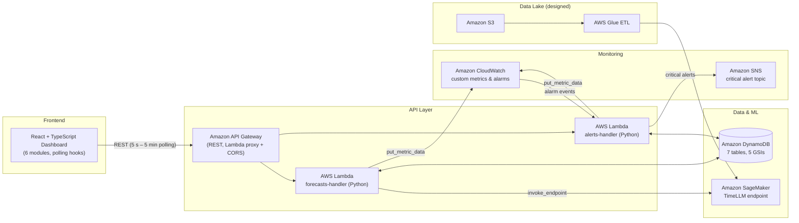

# TimeWise Supply Chain — AWS TimeLLM Platform

An AI-powered supply chain optimization platform that integrates a React + TypeScript dashboard with a serverless AWS backend. Demand forecasts are generated by a TimeLLM time-series model hosted on Amazon SageMaker, persisted in DynamoDB, and served through API Gateway and Lambda, with CloudWatch-driven alerting published to SNS.

## Architecture



### Component Status

| Component | AWS Service | Status |
|---|---|---|
| Forecast API (CRUD + ML inference) | Lambda + API Gateway | Implemented |
| Alerting API (CRUD + acknowledge) | Lambda + API Gateway | Implemented |
| Alarm-driven alert creation | CloudWatch → Lambda → SNS | Implemented |
| Persistence layer (7 tables) | DynamoDB (CloudFormation) | Implemented |
| Custom business metrics | CloudWatch (3 namespaces) | Implemented |
| TimeLLM model hosting | SageMaker endpoint | Integration implemented; model deployed separately |
| Data lake ingestion & ETL | S3 + Glue | Designed (not yet provisioned) |
| Authentication | Cognito | Planned (bearer-token placeholder in client) |

## Data Flow

1. **Ingestion (designed)** — Historical sales, market trends, and inventory data land in an S3 data lake and are cleaned by AWS Glue ETL jobs.
2. **Inference** — `POST /forecasts` triggers the forecasts Lambda, which invokes the SageMaker TimeLLM endpoint with historical data, forecast horizon, and external factors.
3. **Persistence** — Predictions, confidence scores, and model version are written to the `timewise-forecasts` DynamoDB table.
4. **Serving** — Lambda functions serve data to the dashboard through API Gateway (Lambda proxy integration with CORS).
5. **Presentation** — The React dashboard polls typed endpoints on configurable intervals (5 s for alerts up to 5 min for reports) with error boundaries and graceful fallback to static data.
6. **Monitoring** — Both Lambdas emit custom CloudWatch metrics; CloudWatch alarms feed back into the alerts Lambda, which auto-categorizes them (inventory, demand, supply, security, system) and publishes critical alerts to SNS.

## Tech Stack

| Layer | Technologies |
|---|---|
| Frontend | React 18, TypeScript, Vite, Tailwind CSS, Recharts, Lucide React |
| Backend | Python (boto3) Lambda functions, API Gateway REST API |
| Data & ML | DynamoDB (on-demand), SageMaker (TimeLLM), S3 + Glue (designed) |
| Observability | CloudWatch custom metrics and alarms, SNS notifications |
| Infrastructure | CloudFormation (parameterized for dev / staging / prod) |

## Repository Structure

```
├── aws/
│   ├── cloudformation/
│   │   ├── dynamodb-tables.yaml    # 7 tables, 5 GSIs, PITR, TTL
│   │   └── api-gateway.yaml        # REST API, Lambda proxy, CORS
│   └── lambda/
│       ├── forecasts-handler.py    # Forecast CRUD + SageMaker inference
│       └── alerts-handler.py       # Alert CRUD + CloudWatch alarm intake + SNS
└── src/
    ├── components/                 # Dashboard modules
    ├── config/aws.ts               # AWS + API endpoint configuration
    ├── hooks/useApiData.ts         # Generic polling hook + 13 domain hooks
    └── services/apiService.ts      # Typed API client
```

## API Reference

Endpoints backed by the deployed Lambda handlers:

| Method | Path | Description |
|---|---|---|
| `GET` | `/forecasts` | Retrieve demand forecasts (filterable by `productId`) |
| `POST` | `/forecasts` | Generate a new forecast via the SageMaker TimeLLM endpoint |
| `PUT` | `/forecasts/{id}` | Update forecast status |
| `GET` | `/alerts` | List alerts with unacknowledged count |
| `POST` | `/alerts` | Create an alert |
| `POST` | `/alerts/{id}/acknowledge` | Acknowledge an alert |

The frontend client ([src/config/aws.ts](src/config/aws.ts)) additionally defines endpoints for KPIs, data sources, optimization scenarios, inventory optimizations, metrics, reports, analytics insights, access controls, governance metrics, bias detections, and direct SageMaker inference. These render with static fallback data until their backing services are deployed.

## DynamoDB Schema

All tables use on-demand billing and point-in-time recovery.

| Table | Key Schema | Indexes / Features |
|---|---|---|
| `timewise-forecasts` | `forecastId` | GSI: `ProductIndex` (productId, createdAt) |
| `timewise-inventory-alerts` | `alertId` | GSI: `ProductSeverityIndex` (productId, severity) |
| `timewise-kpis` | `kpiId` + `timestamp` | TTL-based expiry |
| `timewise-data-sources` | `sourceId` | GSI: `TypeIndex` (sourceType) |
| `timewise-alerts` | `alertId` | GSI: `CategoryTimeIndex` (category, timestamp) |
| `timewise-metrics` | `metricId` + `timestamp` | TTL-based expiry |
| `timewise-access-controls` | `userId` | GSI: `RoleIndex` (role) |

## Getting Started

### Prerequisites

- Node.js 18+ and npm
- An AWS account with permissions for CloudFormation, DynamoDB, Lambda, API Gateway, CloudWatch, and SNS
- AWS CLI configured (`aws configure`)

### 1. Install and Configure

```bash
npm install
cp .env.example .env   # then set your values
```

| Variable | Purpose |
|---|---|
| `VITE_AWS_REGION` | Deployment region (default `us-east-1`) |
| `VITE_API_GATEWAY_URL` | Base URL output by the API Gateway stack |
| `VITE_SAGEMAKER_ENDPOINT` | Name of the TimeLLM SageMaker endpoint |
| `VITE_COGNITO_USER_POOL_ID` / `VITE_COGNITO_CLIENT_ID` | Reserved for planned Cognito authentication |
| `VITE_ENABLE_*` | Feature flags for real-time updates, analytics, and AI insights |

### 2. Deploy DynamoDB Tables

```bash
aws cloudformation deploy \
  --template-file aws/cloudformation/dynamodb-tables.yaml \
  --stack-name timewise-dynamodb \
  --parameter-overrides Environment=prod
```

### 3. Deploy Lambda Functions

```bash
cd aws/lambda
zip forecasts-handler.zip forecasts-handler.py
zip alerts-handler.zip alerts-handler.py

aws lambda create-function \
  --function-name timewise-forecasts-handler \
  --runtime python3.9 \
  --role arn:aws:iam::<ACCOUNT_ID>:role/<LAMBDA_EXECUTION_ROLE> \
  --handler forecasts-handler.lambda_handler \
  --zip-file fileb://forecasts-handler.zip

aws lambda create-function \
  --function-name timewise-alerts-handler \
  --runtime python3.9 \
  --role arn:aws:iam::<ACCOUNT_ID>:role/<LAMBDA_EXECUTION_ROLE> \
  --handler alerts-handler.lambda_handler \
  --zip-file fileb://alerts-handler.zip
```

The execution role requires access to DynamoDB, CloudWatch (`PutMetricData`), SNS (`Publish`), and SageMaker Runtime (`InvokeEndpoint`).

### 4. Deploy API Gateway

```bash
aws cloudformation deploy \
  --template-file aws/cloudformation/api-gateway.yaml \
  --stack-name timewise-api \
  --parameter-overrides \
    Environment=prod \
    ForecastsLambdaArn=<FORECASTS_LAMBDA_ARN> \
    AlertsLambdaArn=<ALERTS_LAMBDA_ARN>
```

Copy the `APIGatewayURL` stack output into `VITE_API_GATEWAY_URL` in `.env`.

### 5. (Optional) Deploy the TimeLLM Model

Deploy your TimeLLM model to a SageMaker real-time endpoint and set its name in `VITE_SAGEMAKER_ENDPOINT` and in `SAGEMAKER_ENDPOINT` within `forecasts-handler.py`. Without it, `POST /forecasts` returns an error while all read endpoints continue to work.

> **Cost note:** the serverless components (Lambda, API Gateway, on-demand DynamoDB, SNS) cost effectively nothing at development scale. A SageMaker real-time endpoint bills per instance-hour while it exists — delete it when not in use.

### 6. Run the Dashboard

```bash
npm run dev       # local development
npm run build     # production build
npm run lint      # static analysis
```

### Teardown

```bash
aws cloudformation delete-stack --stack-name timewise-api
aws cloudformation delete-stack --stack-name timewise-dynamodb
aws lambda delete-function --function-name timewise-forecasts-handler
aws lambda delete-function --function-name timewise-alerts-handler
```

## Monitoring & Observability

Custom CloudWatch metrics emitted by the Lambda handlers:

| Namespace | Metric | Description |
|---|---|---|
| `TimeWise/API` | `ForecastsRetrieved` | Forecast records served per request |
| `TimeWise/ML` | `ForecastGenerated` | Forecast generation events |
| `TimeWise/ML` | `ForecastAccuracy` | Model-reported accuracy per forecast |
| `TimeWise/Alerts` | `AlertsCreated` | Alert volume, dimensioned by type and category |

CloudWatch alarms route back into the alerts Lambda, which classifies each alarm into one of five supply-chain categories and publishes critical alerts to an SNS topic.

## Security

- Least-privilege IAM roles for Lambda execution
- CORS configured at API Gateway (proxy responses and OPTIONS mock integrations)
- Encryption at rest (DynamoDB default) and in transit (HTTPS)
- Role-based access control model persisted in the `timewise-access-controls` table
- Bearer-token authorization header in the API client; Cognito integration planned

## Roadmap

- [ ] Provision the S3 + Glue data-lake ingestion pipeline
- [ ] Cognito user authentication and API Gateway authorizers
- [ ] Backing services for the remaining dashboard endpoints (KPIs, reports, governance)
- [ ] Automated test suite and CI pipeline
- [ ] Multi-region deployment
- [ ] Real-time streaming analytics (Kinesis)

---

## Appendix: Implementation Inventory

Every quantified claim in this README is traceable to a specific file and line in this repository. This appendix documents the full inventory. Counts can be reproduced with the commands shown in [Reproducing These Counts](#reproducing-these-counts).

### A. Infrastructure as Code

#### A.1 `aws/cloudformation/dynamodb-tables.yaml` — 7 tables, 5 GSIs

One parameterized stack (`Environment`: `dev` | `staging` | `prod`). All 7 tables declare `BillingMode: PAY_PER_REQUEST` and `PointInTimeRecoveryEnabled: true`. Each table name is exported as a CloudFormation output for cross-stack reference (lines 223–264).

| # | Logical Resource | Table Name | Partition / Sort Key | GSI | TTL | Defined At |
|---|---|---|---|---|---|---|
| 1 | `ForecastsTable` | `timewise-forecasts-${Environment}` | `forecastId` | `ProductIndex` (`productId`, `createdAt`) | — | [dynamodb-tables.yaml:13](aws/cloudformation/dynamodb-tables.yaml#L13) |
| 2 | `InventoryAlertsTable` | `timewise-inventory-alerts-${Environment}` | `alertId` | `ProductSeverityIndex` (`productId`, `severity`) | — | [dynamodb-tables.yaml:46](aws/cloudformation/dynamodb-tables.yaml#L46) |
| 3 | `KPIsTable` | `timewise-kpis-${Environment}` | `kpiId` / `timestamp` | — | `ttl` attribute | [dynamodb-tables.yaml:79](aws/cloudformation/dynamodb-tables.yaml#L79) |
| 4 | `DataSourcesTable` | `timewise-data-sources-${Environment}` | `sourceId` | `TypeIndex` (`sourceType`) | — | [dynamodb-tables.yaml:106](aws/cloudformation/dynamodb-tables.yaml#L106) |
| 5 | `AlertsTable` | `timewise-alerts-${Environment}` | `alertId` | `CategoryTimeIndex` (`category`, `timestamp`) | — | [dynamodb-tables.yaml:135](aws/cloudformation/dynamodb-tables.yaml#L135) |
| 6 | `MetricsTable` | `timewise-metrics-${Environment}` | `metricId` / `timestamp` | — | `ttl` attribute | [dynamodb-tables.yaml:168](aws/cloudformation/dynamodb-tables.yaml#L168) |
| 7 | `AccessControlsTable` | `timewise-access-controls-${Environment}` | `userId` | `RoleIndex` (`role`) | — | [dynamodb-tables.yaml:195](aws/cloudformation/dynamodb-tables.yaml#L195) |

All GSIs use `ProjectionType: ALL`. The two time-series tables (KPIs, Metrics) use composite keys plus TTL-based expiry; the other five are keyed on a single ID with query patterns served by their GSIs.

#### A.2 `aws/cloudformation/api-gateway.yaml` — REST API stack

One parameterized stack taking `Environment`, `ForecastsLambdaArn`, and `AlertsLambdaArn` as inputs. Resources declared:

| Resource | Type | Purpose | Defined At |
|---|---|---|---|
| `TimeWiseAPI` | `AWS::ApiGateway::RestApi` | Regional REST API | [api-gateway.yaml:21](aws/cloudformation/api-gateway.yaml#L21) |
| `APIDeployment` | `AWS::ApiGateway::Deployment` | Stage deployment named after `Environment` | [api-gateway.yaml:38](aws/cloudformation/api-gateway.yaml#L38) |
| `ForecastsLambdaPermission` / `AlertsLambdaPermission` | `AWS::Lambda::Permission` | Allow API Gateway to invoke each Lambda | [api-gateway.yaml:48](aws/cloudformation/api-gateway.yaml#L48), [:56](aws/cloudformation/api-gateway.yaml#L56) |
| `ForecastsResource` + `ForecastsMethod` | Resource + `ANY` method | `/forecasts` via `AWS_PROXY` integration | [api-gateway.yaml:65](aws/cloudformation/api-gateway.yaml#L65) |
| `AlertsResource` + `AlertsMethod` | Resource + `ANY` method | `/alerts` via `AWS_PROXY` integration | [api-gateway.yaml:91](aws/cloudformation/api-gateway.yaml#L91) |
| `ForecastsOptionsMethod` / `AlertsOptionsMethod` | `OPTIONS` methods | CORS preflight via `MOCK` integration | [api-gateway.yaml:117](aws/cloudformation/api-gateway.yaml#L117), [:142](aws/cloudformation/api-gateway.yaml#L142) |

The stack outputs `APIGatewayURL` and `APIGatewayId` ([api-gateway.yaml:166-177](aws/cloudformation/api-gateway.yaml#L166-L177)). HTTP-method routing (`GET`/`POST`/`PUT`) is performed inside each Lambda handler, which is why the methods are declared as `ANY`.

### B. Lambda Handlers

#### B.1 `aws/lambda/forecasts-handler.py` (208 lines)

AWS SDK clients initialized at [forecasts-handler.py:13-15](aws/lambda/forecasts-handler.py#L13-L15): DynamoDB (resource), SageMaker Runtime, CloudWatch.

| Route | Function | Behavior | Defined At |
|---|---|---|---|
| `GET /forecasts` | `get_forecasts` | Scans the forecasts table, optional `productId` filter, converts `Decimal` for JSON, emits `ForecastsRetrieved` metric | [forecasts-handler.py:54](aws/lambda/forecasts-handler.py#L54) |
| `POST /forecasts` | `create_forecast` | Invokes the SageMaker TimeLLM endpoint, persists the prediction, emits `ForecastGenerated` + `ForecastAccuracy` metrics | [forecasts-handler.py:99](aws/lambda/forecasts-handler.py#L99) |
| `PUT /forecasts/{id}` | `update_forecast` | Updates forecast status via `update_item` with `ALL_NEW` return | [forecasts-handler.py:163](aws/lambda/forecasts-handler.py#L163) |

SageMaker inference contract ([forecasts-handler.py:103-115](aws/lambda/forecasts-handler.py#L103-L115)) — request fields: `historical_data`, `forecast_horizon` (default 6), `product_id`, `external_factors`; response fields consumed: `predictions`, `confidence`, `modelVersion`, `accuracy`. The persisted DynamoDB item ([forecasts-handler.py:121-129](aws/lambda/forecasts-handler.py#L121-L129)) stores all of these plus a timestamped `forecastId` and `createdAt`.

#### B.2 `aws/lambda/alerts-handler.py` (250 lines)

AWS SDK clients initialized at [alerts-handler.py:13-15](aws/lambda/alerts-handler.py#L13-L15): DynamoDB (resource), CloudWatch, SNS. This handler is **dual-trigger**: the entry point inspects `event.source` and branches between CloudWatch alarm events and API Gateway HTTP requests ([alerts-handler.py:26-43](aws/lambda/alerts-handler.py#L26-L43)).

| Trigger | Function | Behavior | Defined At |
|---|---|---|---|
| CloudWatch alarm (`source == 'aws.cloudwatch'`) | `handle_cloudwatch_alarm` | Converts an `ALARM`-state event into an alert record; severity `critical` if the alarm name contains "critical", else `warning`; publishes critical alerts to SNS | [alerts-handler.py:59](aws/lambda/alerts-handler.py#L59) |
| `GET /alerts` | `get_alerts` | Scans, sorts newest-first, returns `count` and `unacknowledged` totals | [alerts-handler.py:93](aws/lambda/alerts-handler.py#L93) |
| `POST /alerts` | `create_alert` | Writes an alert item and emits the dimensioned `AlertsCreated` metric | [alerts-handler.py:119](aws/lambda/alerts-handler.py#L119) |
| `POST /alerts/{id}/acknowledge` | `acknowledge_alert` | Sets `acknowledged = true` with `acknowledgedAt` timestamp | [alerts-handler.py:172](aws/lambda/alerts-handler.py#L172) |

Alarm auto-classification (`determine_category`, [alerts-handler.py:198-210](aws/lambda/alerts-handler.py#L198-L210)) — 5 categories by keyword match on the alarm name:

| Category | Trigger Keywords |
|---|---|
| `inventory` | "inventory", "stock" |
| `demand` | "demand", "forecast" |
| `supply` | "supply", "supplier" |
| `security` | "security", "access" |
| `system` | (default) |

SNS publication for critical alerts: `send_sns_notification` at [alerts-handler.py:212](aws/lambda/alerts-handler.py#L212).

### C. API Surface — 14 Endpoints

All endpoint URLs are centralized in `API_ENDPOINTS` ([src/config/aws.ts:32-47](src/config/aws.ts#L32-L47)) and consumed by the typed client `ApiService` ([src/services/apiService.ts](src/services/apiService.ts)), which declares 22 async methods (21 effective — see [Known Issues](#e-known-issues)) sharing a single `fetchWithAuth` wrapper that injects the bearer token and normalizes errors.

| # | Endpoint | Client Methods | Backend Status |
|---|---|---|---|
| 1 | `/forecasts` | `getForecasts`, `updateForecast` | **Deployed** (forecasts Lambda) |
| 2 | `/alerts` | `getAlerts`, `acknowledgeAlert` | **Deployed** (alerts Lambda) |
| 3 | `/inventory-alerts` | `getInventoryAlerts`, `acknowledgeAlert` | Client-defined; static fallback |
| 4 | `/kpis` | `getKPIs` | Client-defined; static fallback |
| 5 | `/data-sources` | `getDataSources`, `updateDataSource` | Client-defined; static fallback |
| 6 | `/optimization-scenarios` | `getOptimizationScenarios`, `runOptimization` | Client-defined; static fallback |
| 7 | `/inventory-optimizations` | `getInventoryOptimizations`, `applyOptimization` | Client-defined; static fallback |
| 8 | `/metrics` | `getMetrics` | Client-defined; static fallback |
| 9 | `/reports` | `getReports`, `generateReport` | Client-defined; static fallback |
| 10 | `/analytics-insights` | `getAnalyticsInsights` | Client-defined; static fallback |
| 11 | `/access-controls` | `getAccessControls`, `updateUserAccess` | Client-defined; static fallback |
| 12 | `/governance-metrics` | `getGovernanceMetrics` | Client-defined; static fallback |
| 13 | `/bias-detections` | `getBiasDetections` | Client-defined; static fallback |
| 14 | `/sagemaker/inference` | `runSageMakerInference` | Client-defined; static fallback |

### D. Frontend Inventory

#### D.1 Dashboard modules — 6 tabs

Tab registry at [src/App.tsx:192-199](src/App.tsx#L192-L199): Overview, Data Pipeline, Optimization, Monitoring, Analytics, Responsible AI.

| Component | Lines | Renders |
|---|---|---|
| `App.tsx` (Overview tab inline) | 399 | KPI cards, AWS service status grid, forecast chart, critical alerts panel |
| `DataIngestionPanel.tsx` | 290 | Data source status (S3 / Kinesis / RDS / API types), quality scores, ETL pipeline view |
| `LogisticsOptimization.tsx` | 298 | Optimization scenarios and inventory recommendations |
| `MonitoringAlerts.tsx` | 371 | Alert feed, system health, acknowledgment actions |
| `ReportingAnalytics.tsx` | 365 | AI insights, report generation, executive views |
| `ResponsibleAI.tsx` | 523 | RBAC access controls, AI governance metrics, bias detection tracking |
| `DataStatus.tsx` / `ErrorBoundary.tsx` / `LoadingSpinner.tsx` | 54 / 67 / 26 | Shared utilities: freshness indicator, crash isolation, loading states |

#### D.2 Data-fetching hooks — 1 generic + 13 domain hooks

The generic `useApiData<T>` hook ([src/hooks/useApiData.ts:9-58](src/hooks/useApiData.ts#L9-L58)) provides loading/error/`lastUpdated` state, a manual `refresh()`, and interval-based auto-refresh (default 30 s). Thirteen domain hooks wrap it with per-domain polling cadences ([src/hooks/useApiData.ts:61-111](src/hooks/useApiData.ts#L61-L111)):

| Hook | Interval | Hook | Interval |
|---|---|---|---|
| `useAlerts` | 5 s | `useInventoryOptimizations` | 60 s |
| `useInventoryAlerts` | 10 s | `useAccessControls` | 60 s |
| `useMetrics` | 10 s | `useBiasDetections` | 60 s |
| `useDataSources` | 15 s | `useOptimizationScenarios` | 120 s |
| `useKPIs` | 30 s | `useAnalyticsInsights` | 180 s |
| `useGovernanceMetrics` | 30 s | `useReports` | 300 s |
| `useForecasts` | 60 s | | |

If an API call fails, components fall back to static default data (e.g., [src/App.tsx:56-83](src/App.tsx#L56-L83)) so the dashboard degrades gracefully instead of blanking.

#### D.3 Frontend note on displayed figures

The KPI values shown in the UI when no backend is connected (forecast accuracy, cost savings, records processed, etc.) are **static fallback demo data**, defined at [src/App.tsx:57-78](src/App.tsx#L57-L78) and in each component's `default*` constants. They are placeholders for layout and demo purposes, not measured results.

### E. Observability — 4 Custom Metrics, 3 Namespaces

Three `put_metric_data` call sites emit four distinct metrics:

| Namespace | Metric | Unit | Dimensions | Emitted By |
|---|---|---|---|---|
| `TimeWise/API` | `ForecastsRetrieved` | Count | — | [forecasts-handler.py:73-83](aws/lambda/forecasts-handler.py#L73-L83) |
| `TimeWise/ML` | `ForecastGenerated` | Count | — | [forecasts-handler.py:134-148](aws/lambda/forecasts-handler.py#L134-L148) |
| `TimeWise/ML` | `ForecastAccuracy` | Percent | — | [forecasts-handler.py:134-148](aws/lambda/forecasts-handler.py#L134-L148) |
| `TimeWise/Alerts` | `AlertsCreated` | Count | `AlertType`, `Category` | [alerts-handler.py:138-157](aws/lambda/alerts-handler.py#L138-L157) |

The `AlertsCreated` dimensions enable per-severity and per-category CloudWatch dashboards and alarms. Note that in CloudWatch billing terms, each unique dimension combination counts as a separate custom metric.

### F. Known Issues

- `ApiService.acknowledgeAlert` is declared twice ([src/services/apiService.ts:42](src/services/apiService.ts#L42) targeting `/inventory-alerts`, [src/services/apiService.ts:92](src/services/apiService.ts#L92) targeting `/alerts`); the second declaration silently overrides the first, so inventory-alert acknowledgment currently hits the wrong endpoint.
- `get_forecasts` and `get_alerts` use DynamoDB `Scan`; at production scale these should be `Query` operations against the provisioned GSIs.
- The SNS topic ARN in `send_sns_notification` ([alerts-handler.py:215](aws/lambda/alerts-handler.py#L215)) is a hardcoded placeholder and must be replaced at deployment.
- No automated test suite exists yet (see Roadmap).

### G. Codebase Statistics

3,606 lines across TypeScript/TSX, Python, and CloudFormation YAML:

| Area | Files | Lines |
|---|---|---|
| Frontend components (`src/*.tsx`, `src/components/`) | 9 | 2,180 |
| Frontend config / hooks / services (`src/config`, `src/hooks`, `src/services`) | 3 | 305 |
| Lambda handlers (`aws/lambda/`) | 2 | 458 |
| CloudFormation templates (`aws/cloudformation/`) | 2 | 439 |
| Other (`main.tsx`, type declarations) | 2 | 11 |

### Reproducing These Counts

```bash
# 7 DynamoDB tables, 5 GSIs, 7 PITR blocks, 2 TTL blocks
grep -c "AWS::DynamoDB::Table"           aws/cloudformation/dynamodb-tables.yaml
grep -c "IndexName:"                     aws/cloudformation/dynamodb-tables.yaml
grep -c "PointInTimeRecoverySpecification" aws/cloudformation/dynamodb-tables.yaml
grep -c "TimeToLiveSpecification"        aws/cloudformation/dynamodb-tables.yaml

# 14 API endpoints, 22 declared client methods, 14 exported hooks (1 generic + 13 domain)
grep -c "AWS_CONFIG.apiGateway.baseUrl"  src/config/aws.ts
grep -c "^  async "                      src/services/apiService.ts
grep -c "^export function use"           src/hooks/useApiData.ts

# 4 custom CloudWatch metrics across 3 namespaces
grep -h "MetricName" aws/lambda/*.py | sort -u
grep -h "Namespace=" aws/lambda/*.py | sort -u

# 5 alert categories, 6 dashboard tabs
grep -n "return '" aws/lambda/alerts-handler.py
grep -n "{ id: '"  src/App.tsx

# Total lines of code
find src aws -name "*.ts" -o -name "*.tsx" -o -name "*.py" -o -name "*.yaml" | xargs wc -l
```

## License

MIT
